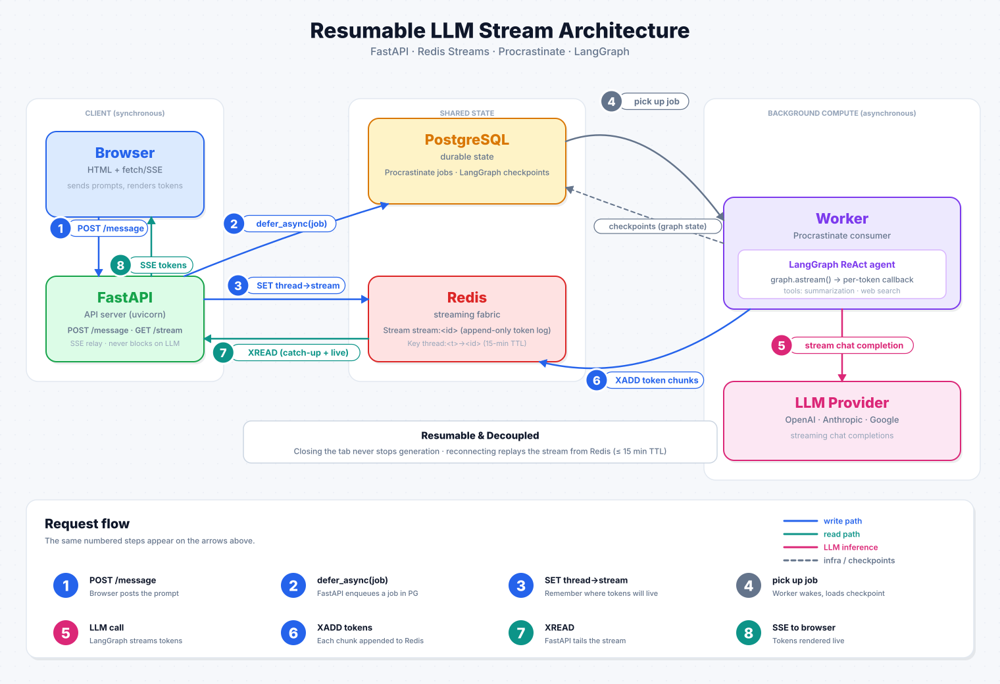

## Streaming Chat Template (FastAPI · Redis Streams · LangGraph)

High-level template for resumable LLM token streaming using FastAPI, Redis Streams, and LangGraph with a Postgres checkpointer. Includes a minimal frontend and clean SSE streaming endpoints.

### Architecture



### UI Preview


### Features

- **Task queue**: Conversations tasks are stored in a queue and handled by workers as they pop in the queue
- **Resumable streaming**: Tokens are streamed into Redis; clients consume via SSE and can resume after network hiccups.
- **LangGraph Persistence**: Conversation state persisted via LangGraph Postgres checkpointer.
- **ReAct agent**: Simple Agent with a simple web-search tool and summarization hook for long context.
- **Minimal UI**: Static frontend served from `src/frontend/`.

### Run the project

1. Configure the app:
- Create a `.env` file in the project root containing your API keys.
- Select the LLM provider/model in `src/ai/config.py` under the `config` mapping (supported: `openai`, `anthropic`, `google`).

2. Start the app

```bash
docker compose up --build
```

### How streaming works

**Three processes, three stores:**
- **API** (FastAPI) — accepts requests, enqueues jobs, relays SSE.
- **Worker** (procrastinate) — consumes jobs from Postgres, runs LangGraph, writes tokens to Redis.
- **Redis Stream** — per-generation token buffer (15-min TTL, see `STREAM_TTL_SECONDS`). Each call to `/v1/chat/message` mints a fresh `stream_id`; tokens are appended with `XADD`. A log, not a queue — any number of SSE readers can tail it on their own cursor.
- **Postgres** — holds both the procrastinate job table and the LangGraph checkpointer. The conversation history is only written when a graph node completes, so an in-flight reply is **not** checkpointed yet.

**Request flow:**
1. `POST /v1/chat/message` mints `stream_id`, stores `thread_id → stream_id` in Redis, `defer_async`s a `generate_response` procrastinate job, and returns 200 immediately.
2. The worker picks up the job, runs `graph.astream(...)`, and `XADD`s each token to the Redis stream. It's decoupled from the HTTP request — closing the tab does not stop generation.
3. `GET /v1/chat/stream?thread_id=...` looks up `stream_id`, opens an `XREAD` loop, and relays tokens to the client as SSE events (via `sse-starlette`).

**Reconnecting (close tab, reopen):**
On load the frontend calls `GET /v1/threads` → picks the most recent → loads history from Postgres via `GET /v1/thread` → opens SSE. The SSE endpoint `XREAD`s from the start of the active stream (or from the last `message_ended` marker, if one exists). The client sees two phases back-to-back:
- **Catch-up** — all backlogged tokens arrive in a burst and paint near-instantly.
- **Live** — new tokens stream one-by-one as the LLM continues.

Both phases go through the same code path; the transition is seamless. Multiple tabs on the same thread work for free — each `XREAD` holds its own cursor.

**Limits / notes:**
- Redis keys (stream, status, mapping) expire after `STREAM_TTL_SECONDS` (default 900s). Reconnect later than that and you see only what reached Postgres.
- The procrastinate job is durable in Postgres, but the task currently has retries disabled: a worker crash mid-generation leaves the job in a "doing" state; the client sees whatever tokens made it to Redis before the crash but no retry drives generation forward. Enabling retries (`@app.task(retry=...)`) would require making the token stream idempotent (e.g., clear the stream before re-running) to avoid duplicated output on the resumable SSE channel.

### API
- `POST /v1/chat/message`
  - Body: `{ "message": string, "thread_id"?: uuid }`
  - Returns 200 immediately; generation continues in background and tokens are streamed to Redis.

- `GET /v1/chat/stream?thread_id=<uuid>` (SSE)
  - Emits events: `chunk` (token text), `tool_call` (tool name), `system` (markers like `message_ended`, `end`).
  - Returns 204 when there is no active or already-completed stream.

- `GET /v1/thread?thread_id=<uuid>`
  - Returns the normalized message history for a thread.

- `DELETE /v1/thread?thread_id=<uuid>`
  - Deletes a thread from the DB.

- `PATCH /v1/thread?thread_id=<uuid>`
  - Body: `{ "chat_name": string }` – updates chat title.

### Minimal SSE client example (browser)
```html
<script>
  const threadId = crypto.randomUUID();

  // 1) Send a message (start background generation)
  fetch('/v1/chat/message', {
    method: 'POST',
    headers: { 'Content-Type': 'application/json' },
    body: JSON.stringify({ message: 'Hello!', thread_id: threadId })
  });

  // 2) Stream tokens
  const es = new EventSource(`/v1/chat/stream?thread_id=${threadId}`);
  es.onmessage = (e) => console.log('data:', e.data);
  es.addEventListener('chunk', (e) => console.log('chunk:', e.data));
  es.addEventListener('tool_call', (e) => console.log('tool:', e.data));
  es.addEventListener('system', (e) => {
    console.log('system:', e.data);
    if (e.data === 'end') es.close();
  });
</script>
```

